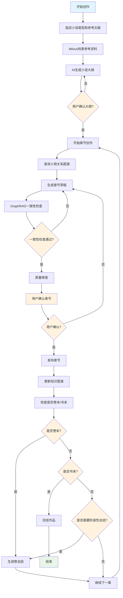
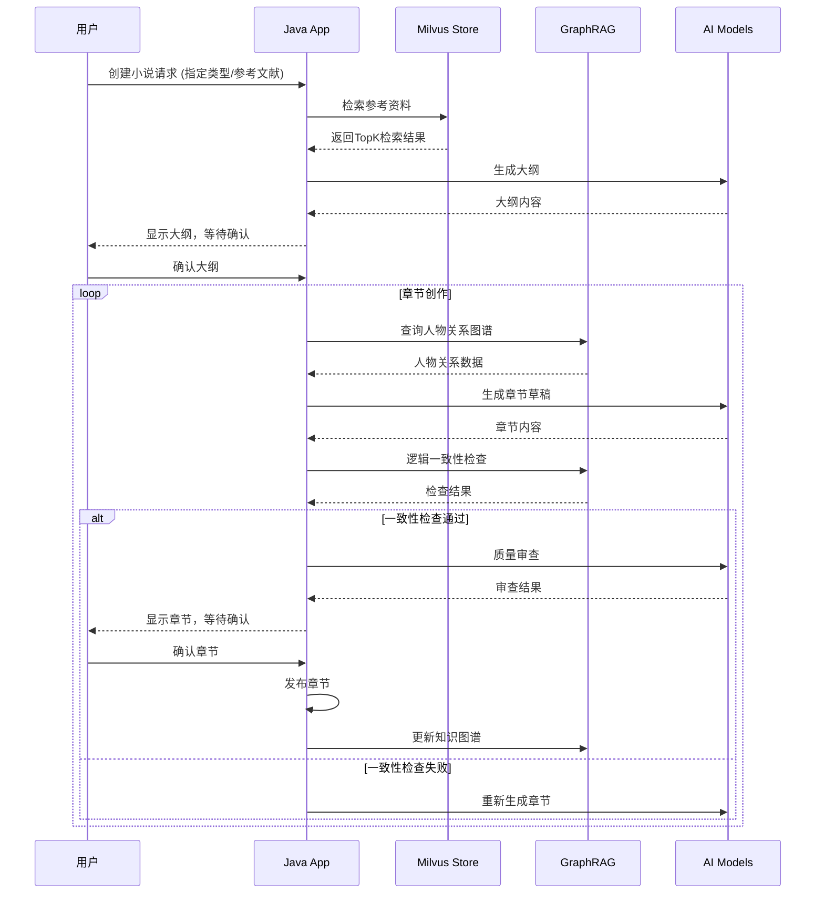

# 小说创作流程详解

## 完整创作流程图



## 关键节点说明

### 1. 参考资料检索
- 从 Milvus 向量数据库检索相关写作理论和参考小说
- 提取有用的写作技巧、故事结构、人物塑造方法等

### 2. 大纲生成与确认
- AI 结合检索结果生成小说大纲
- 用户确认机制确保创作方向符合预期

### 3. 章节创作循环
- 每章都经过多重检查确保质量
- 人物关系图谱确保角色一致性
- GraphRAG 确保逻辑一致性

### 4. 质量控制
- AI 自动审查
- 用户手动确认
- 逻辑一致性检查

### 5. 知识管理
- 知识图谱持续更新
- 阶段性总结维护连贯性
- 人物关系图谱动态维护
```

## API 调用时序

