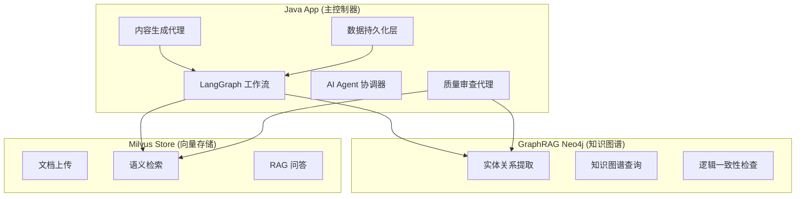

# XSun Novel Factory - AI驱动的智能小说创作平台

## 项目概述

XSun Novel Factory 是一个基于 AI 技术的智能小说创作平台，利用 LangGraph、GraphRAG、向量数据库和大语言模型技术，实现自动化小说创作流程。项目采用微服务架构，分为三个核心服务：

1. **Java App** - 主应用服务，负责业务逻辑、LangGraph 工作流编排和 AI 代理协调
2. **GraphRAG Neo4j** - 知识图谱服务，用于存储和查询小说中的实体关系
3. **Milvus Store** - 向量存储服务，用于语义检索和相似性匹配

## 架构设计



## 核心功能

### 1. 小说创作流程方案

基于 LangGraph 的完整小说创作流程包括以下几个关键步骤：

#### 1.1 参考资料维护
- **Milvus 维护写作资源**：存储小说、作品、写作理论类型的书籍
- 支持多种文档类型：story（故事）、technique（技巧）、notes（笔记）、world_setting（世界观设定）
- 为后续创作提供丰富的参考素材

#### 1.2 小说创建流程
- **指定类型**：用户指定小说类型（如玄幻、都市、科幻等）
- **Milvus 检索**：指定需要查询的参考文献，AI 生成写大纲相关问题，交由 Milvus 做相似度检索
- **生成大纲**：获取检索结果 TopK，结合检索结果生成大纲，返回给用户确认

#### 1.3 大纲确认机制
- 用户确认生成的大纲（yes/no）
- yes：确认大纲并进入写作阶段
- no：重新生成大纲

#### 1.4 章节写作流程
- **GraphRAG 一致性检查**：章节写完后首先交由 GraphRAG 做全局一致性检查
- **审核机制**：审核不通过重写，审核通过给前端用户确认
- **用户确认**：用户确认（yes/no）
  - yes：入库并进入下一章
  - no：打回重写，重复上述写章节流程

#### 1.5 章节完成判断
- **卷/书完结判断**：AI 需要判断是否为某卷完结或本书最后一章
- **章节总结生成**：
  - 若是本卷最后一章：结合之前的章节总结，生成该卷总结
  - 若是本书最后一章：完结整个作品
- **阶段性总结**：每10章生成一个临时总结，用于后续创作参考

#### 1.6 人物关系管理
- **写作依据**：章节写之前查询上章需出现人物的 GraphRAG 人物关系图表
- **知识图谱更新**：章节审核通过后交由 GraphRAG 进行入库，返回人物关系图表用于下一章创作

#### 1.7 上下文管理
- **上下文携带**：新章节写作时携带人物关系图表、最近一次总结、最近3章内容
- **连贯性保障**：确保长期创作的连贯性和一致性

### 2. LangGraph 工作流节点

#### 工作流节点
- **Init Node**: 初始化小说项目，生成基本框架和设定
- **Retrieve References Node**: 检索 Milvus 中的参考资料
- **Generate Outline Node**: 基于参考生成小说大纲
- **Confirm Outline Node**: 等待用户确认大纲
- **Generate Chapter Node**: 生成章节草稿
- **Check Consistency Node**: 使用 GraphRAG 进行一致性检查
- **Review Node**: 质量审查
- **Confirm Chapter Node**: 等待用户确认章节
- **Publish Node**: 发布章节
- **Update Graph Node**: 更新知识图谱
- **Check Completion Node**: 检查是否为卷末/书末
- **Summarize Node**: 生成章节总结
- **Check Milestone Node**: 检查是否需要阶段性总结

#### 工作流状态
- **novelId**: 小说唯一标识符
- **chapterNo**: 当前章节编号
- **createdBy**: 创建者标识
- **draftId**: 草稿ID
- **reviewId**: 审查记录ID
- **decision**: 审查决策
- **chapterId**: 正式章节ID
- **chapterVersion**: 章节版本号
- **outboxEventId**: 出箱事件ID
- **outlineConfirmed**: 大纲是否确认
- **consistencyPassed**: 一致性检查是否通过
- **chapterConfirmed**: 章节是否确认
- **completionStatus**: 完结状态（CONTINUE/VOLUME_END/BOOK_END）
- **needsMilestoneSummary**: 是否需要里程碑总结

### 3. AI 代理系统

#### 内容生成代理 (Content Generation Agent)
- 利用大语言模型生成高质量小说章节内容
- 基于前期章节内容、人物关系图谱和大纲指导创作
- 维护故事连贯性和人物一致性
- 结合 Milvus 检索的相关信息进行创作

#### 质量审查代理 (Quality Review Agent)
- 自动审查生成内容的质量
- 检查连贯性、风格一致性和剧情一致性
- 集成 GraphRAG 进行逻辑错误检测
- 提供修改建议和审查报告

### 4. 知识图谱服务 (GraphRAG)

#### 接口功能
- **/graph/extract**: 从章节内容中提取实体和关系并存入 Neo4j
  - 支持提取人物、地点、组织、事件等实体
  - 建立实体间的关系网络

- **/graph/query**: 查询知识图谱信息
  - 支持人物查询（character）- 查询人物及其关系
  - 支持地点查询（location）- 查询地点信息
  - 支持组织查询（organization）- 查询组织信息
  - 支持时间线查询（timeline）- 查询章节时间线事件

- **/graph/check-logic**: 检查新章节内容是否存在逻辑错误
  - 基于已有知识图谱检测逻辑矛盾
  - 确保人物关系、事件时间线的一致性

### 5. 向量存储服务 (Milvus Store)

#### 接口功能
- **/health**: 检查服务健康状态
  - 返回 Milvus 连接状态、集合信息等

- **/works/upload**: 上传作品文档到向量库
  - 支持多种文档类型：story（故事）、technique（技巧）、notes（笔记）、world_setting（世界观设定）
  - 自动分块处理大文档
  - 生成向量嵌入并存储

- **/rag/retrieve**: 执行 RAG 检索
  - 基于语义相似性检索相关内容
  - 支持多种过滤条件（作品ID、类型、标签等）

## 数据模型

### 核心实体
- **Novel**: 小说主表，存储作品的基本信息
- **Chapter**: 正式章节表，存储审核通过的章节内容
- **ChapterDraft**: 章节草稿表，存储创作过程中的草稿
- **ChapterReview**: 章节审查记录表，存储审查历史和证据
- **OutboxEvent**: 出箱事件表，用于可靠异步通知 GraphRAG
- **Summary**: 总结表，存储章节和卷的总结信息

### 审查证据来源
- **Chroma 命中片段**: 向量检索发现的相关内容
- **GraphRAG 发现**: 知识图谱中发现的实体关系和逻辑矛盾

## 集成接口

### Feign 客户端
- **GraphRagClient**: 与 GraphRAG 服务通信
- **MilvusStoreClient**: 与 Milvus 向量存储服务通信

### 配置参数
```yaml
# GraphRAG 知识图谱服务配置
graph:
  rag:
    service:
      url: http://127.0.0.1:8000

# Milvus 向量存储服务配置  
milvus:
  store:
    service:
      url: http://127.0.0.1:8001
```

## 小说创作流程详解

1. **初始化阶段**:
   - 创建新的小说项目
   - 生成基础设定和大纲
   
2. **参考资料检索阶段**:
   - 从 Milvus 检索相关写作理论和参考小说
   - 为大纲生成提供素材

3. **大纲生成与确认阶段**:
   - AI 结合检索结果生成小说大纲
   - 用户确认大纲后进入写作阶段

4. **章节写作阶段**:
   - 基于前期内容和人物关系图谱生成章节
   - 每章完成后进行一致性检查和质量审查
   - 用户确认后发布章节

5. **知识图谱更新阶段**:
   - 章节发布后更新 GraphRAG 知识图谱
   - 维护人物关系和事件关系

6. **阶段性总结阶段**:
   - 每10章生成阶段性总结
   - 卷末生成卷总结
   - 书末完结作品

## 技术栈

- **Java App**: Spring Boot, LangGraph4j, LangChain4j, MyBatis-Plus, OpenFeign
- **GraphRAG**: FastAPI, Neo4j, OpenAI API
- **Milvus Store**: FastAPI, Milvus, Sentence Transformers
- **前端**: Vue.js (可选)

## 部署说明

### 环境要求
- Java 21+
- Maven 3.8+
- Docker (用于运行 Neo4j 和 Milvus)
- Python 3.9+ (用于运行 Python 服务)

### 部署步骤

1. **启动 Java 应用**:
   ```bash
   cd java_app
   mvn spring-boot:run
   ```

2. **启动 GraphRAG 服务**:
   ```bash
   cd graph_rag_neo4j
   python3.13 -m venv venv
   source ./venv/bin/activate
   pip install -r requirements.txt
   nohup python3.13 -m uvicorn app.main:app --host 0.0.0.0 --port 8000 > graph_rag_neo4j.log 2>&1 &
   ```

3. **启动 Milvus Store 服务**:
   ```bash
   cd milvus_store
   python3.13 -m venv venv
   source ./venv/bin/activate
   pip install -r requirements.txt
   nohup python3.13 -m uvicorn app.main:app --host 0.0.0.0 --port 8001 > milvus_store.log 2>&1 &
 ```

## API 示例

### 基础 API
#### 创建新小说
```bash
curl -X POST "http://localhost:8080/novel/init"
```

#### 生成并审查章节
```bash
curl -X POST "http://localhost:8080/novel/{novelId}/chapter/{chapterNo}/run?createdBy=user"
```

### 完整创作流程 API
#### 创建小说（完整流程）
```bash
curl -X POST "http://localhost:8080/novel-workflow/create-full" \
  -H "Content-Type: application/json" \
  -d '{
    "novelType": "玄幻",
    "referenceNovelId": "ref_novel_001",
    "referenceNovelStyle": "东方玄幻，修仙题材"
  }'
```

#### 写作章节（带完整检查流程）
```bash
curl -X POST "http://localhost:8080/novel-workflow/{novelId}/chapter/{chapterNo}/write-full?createdBy=user"
```

## 优势特性

1. **智能创作**: 利用 AI 模型生成高质量内容
2. **质量保证**: 多层次质量审查机制，包括 AI 审查和用户确认
3. **一致性维护**: GraphRAG 确保故事连贯性，Milvus 提供语义参考
4. **可扩展性**: 微服务架构，易于扩展
5. **自动化流程**: LangGraph 实现全自动化工作流
6. **语义检索**: 向量存储支持智能内容检索
7. **用户参与**: 关键节点提供用户确认机制
8. **长期连贯**: 阶段性总结确保长篇创作的一致性

## 应用场景

- 自动生成长篇小说内容
- 辅助作家进行创作
- 游戏剧情生成
- 个性化故事定制
- 内容审核和质量评估