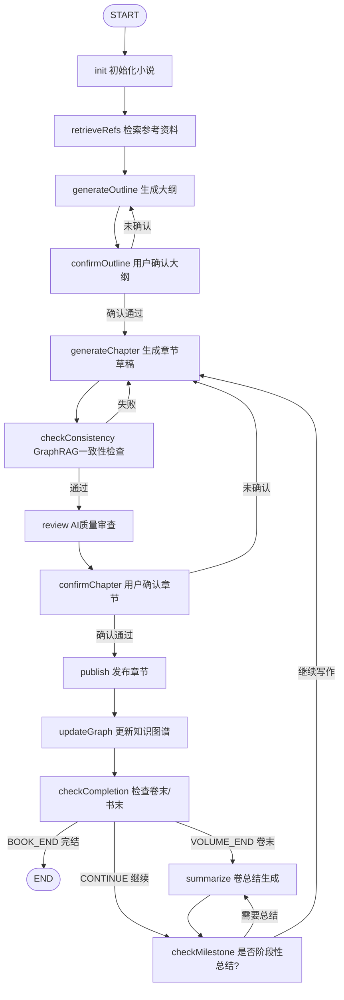

```mermaid
 flowchart TD

    START([START]) --> init[init 初始化小说]

    init --> retrieveRefs[retrieveRefs 检索参考资料]

    retrieveRefs --> generateOutline[generateOutline 生成大纲]

    generateOutline --> confirmOutline[confirmOutline 用户确认大纲]

    confirmOutline -->|未确认| generateOutline
    confirmOutline -->|确认通过| generateChapter

    generateChapter[generateChapter 生成章节草稿]
        --> checkConsistency[checkConsistency GraphRAG一致性检查]

    checkConsistency -->|失败| generateChapter
    checkConsistency -->|通过| review

    review[review AI质量审查]
        --> confirmChapter[confirmChapter 用户确认章节]

    confirmChapter -->|未确认| generateChapter
    confirmChapter -->|确认通过| publish

    publish[publish 发布章节]
        --> updateGraph[updateGraph 更新知识图谱]

    updateGraph --> checkCompletion[checkCompletion 检查卷末/书末]

    checkCompletion -->|BOOK_END 完结| END([END])

    checkCompletion -->|VOLUME_END 卷末| summarize

    checkCompletion -->|CONTINUE 继续| checkMilestone

    summarize[summarize 卷总结生成]
        --> checkMilestone

    checkMilestone[checkMilestone 是否阶段性总结?]

    checkMilestone -->|需要总结| summarize
    checkMilestone -->|继续写作| generateChapter

```